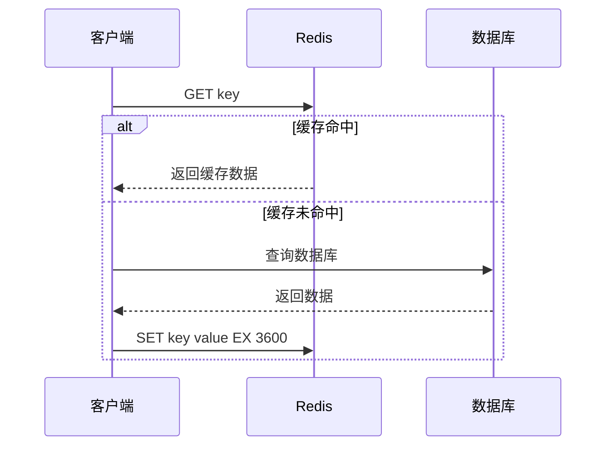
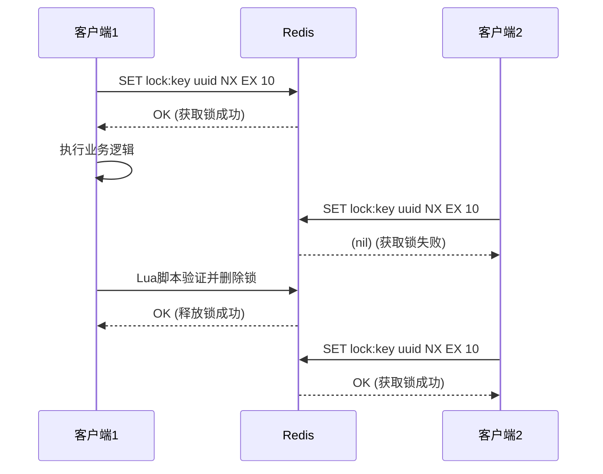
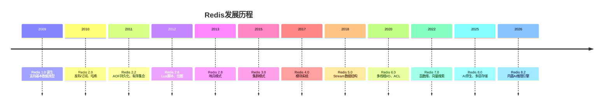
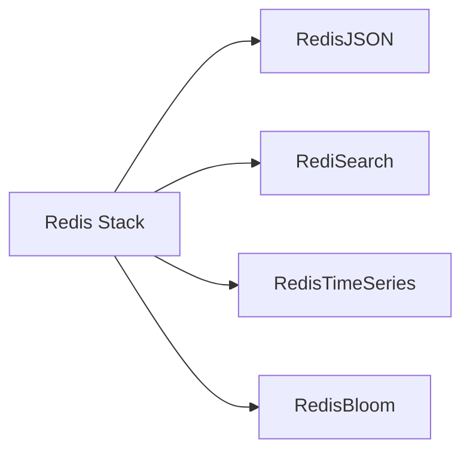
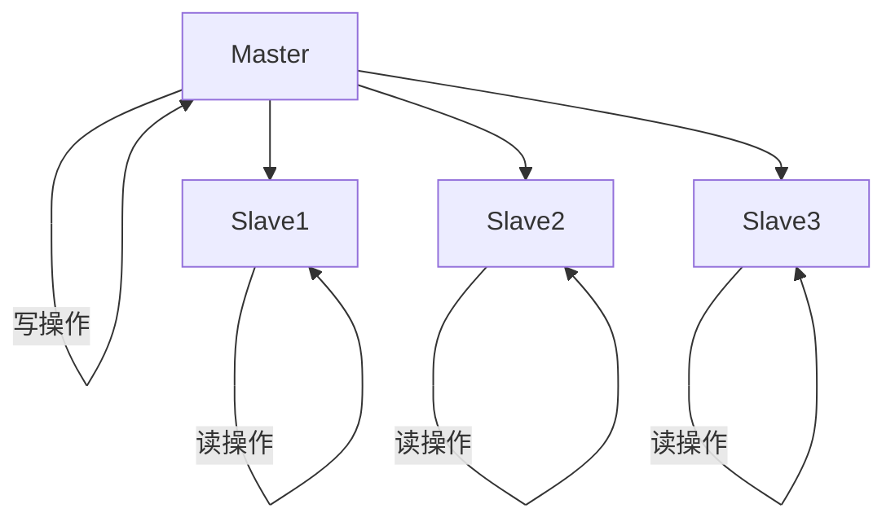
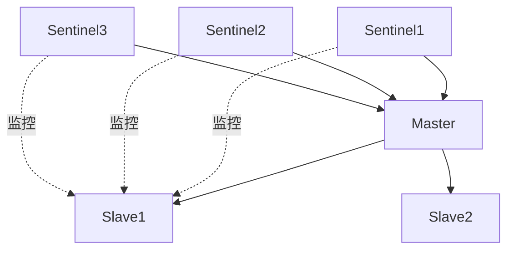
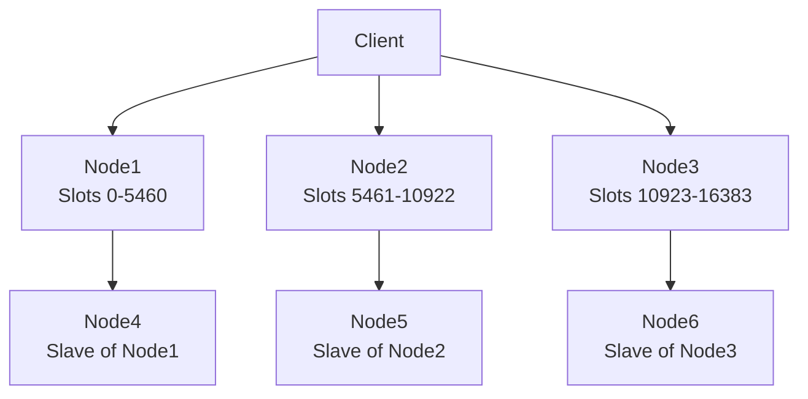

# Redis 全指南:从入门到精通的完整教程

## 前言

Redis(Remote Dictionary Server)是一个开源的内存数据结构存储系统,可以用作数据库、缓存和消息中间件。自2009年诞生以来,Redis已经发展成为全球最受欢迎的内存数据库之一,被广泛应用于各种场景,从简单的缓存系统到复杂的实时分析平台。

本文将带你全面了解Redis的核心概念、数据结构、应用场景、实战技巧以及最新特性,帮助你从零开始掌握这个强大的工具。

---

## 一、Redis简介与核心特点

### 什么是Redis?

Redis是一个基于键值对(Key-Value)的内存数据库,它支持多种数据结构,如字符串、哈希、列表、集合和有序集合。Redis以其高性能、丰富的数据结构和强大的功能而闻名,广泛应用于缓存、会话存储、排行榜、实时分析等场景。

### Redis的核心特点

**1. 极高性能**
- 读写速度可达10万次/秒
- 响应时间在毫秒级
- 纯内存操作,无磁盘I/O瓶颈

**2. 丰富数据类型**
- 字符串(String)
- 哈希(Hash)
- 列表(List)
- 集合(Set)
- 有序集合(ZSet)
- 位图(Bitmap)
- JSON(RedisJSON)

**3. 原子操作**
- 所有操作都是原子的
- 保证数据一致性
- 支持事务和Lua脚本

**4. 持久化支持**
- RDB(Redis Database):快照持久化
- AOF(Append Only File):日志持久化
- 可同时使用两种方式

**5. 主从复制**
- 支持数据复制
- 提高可用性和读取性能
- 支持读写分离

**6. 高可用**
- 支持哨兵(Sentinel)模式
- 支持集群(Cluster)模式
- 自动故障转移

### Redis应用场景

```mermaid
graph TD
    A[Redis应用场景] --> B[缓存系统]
    A --> C[会话存储]
    A --> D[排行榜]
    A --> E[消息队列]
    A --> F[计数器]
    A --> G[地理位置]
    A --> H[分布式锁]
    A --> I[限流控制]

    B --> B1[数据库查询缓存]
    B --> B2[API响应缓存]
    B --> B3[页面静态化]

    C --> C1[分布式Session]
    C --> C2[用户状态管理]
    C --> C3[购物车数据]

    D --> D1[游戏积分排行]
    D --> D2[销售排行]
    D --> D3[热点排行]

    E --> E1[异步任务处理]
    E --> E2[服务解耦]
    E --> E3[流量削峰]

    F --> F1[文章阅读量]
    F --> F2[视频播放量]
    F --> F3[点赞数统计]

    G --> G1[附近的人]
    G --> G2[配送范围]
    G --> G3[位置搜索]

    H --> H1[防重复下单]
    H --> H2[库存扣减]
    H --> H3[资源互斥]

    I --> I1[API限流]
    I --> I2[防刷]
    I --> I3[速率控制]
```



---

## 二、Redis安装与配置

### Linux/Mac安装

```bash
# 使用Homebrew安装(Mac)
brew install redis

# 使用apt安装(Ubuntu/Debian)
sudo apt-get install redis-server

# 使用yum安装(CentOS/RHEL)
sudo yum install redis
```

### 启动Redis

```bash
# 启动Redis服务器
redis-server

# 使用配置文件启动
redis-server /path/to/redis.conf

# 连接到Redis客户端
redis-cli
```

### Docker安装

```bash
# 拉取Redis镜像
docker pull redis

# 运行Redis容器
docker run -d -p 6379:6379 --name my-redis redis:latest

# 使用Redis Stack(包含多个模块)
docker run -d -p 6379:6379 redis/redis-stack-server:latest
```

### 基本配置

Redis的配置文件`redis.conf`包含大量可配置选项:

```conf
# 监听端口
port 6379

# 绑定地址
bind 127.0.0.1

# 持久化配置
save 900 1
save 300 10
save 60 10000

# AOF配置
appendonly yes
appendfsync everysec

# 内存配置
maxmemory 256mb
maxmemory-policy allkeys-lru

# 日志级别
loglevel notice

# 数据库数量
databases 16
```

---

## 三、Redis基础概念

### 键(Key)

Redis中的键是二进制安全的,可以使用任何字符串作为键名。

**键命名建议:**
- 使用冒号分隔不同层级:`user:1001:profile`
- 保持键名简洁但有意义
- 避免使用过长的键名
- 使用统一的前缀管理不同类型的数据

### 值(Value)

Redis支持多种数据类型的值,每种类型都有其特定的用途和操作命令。

### 数据库

Redis默认支持16个数据库(索引0-15),可以使用SELECT命令切换数据库。

```bash
# 切换到数据库1
SELECT 1

# 查看当前数据库的键数量
DBSIZE

# 清空当前数据库
FLUSHDB

# 清空所有数据库
FLUSHALL
```

---

## 四、Redis数据类型详解

### 1. 字符串(String)

字符串是Redis最基本的数据类型,可以存储任何形式的数据,包括文本、数字、二进制数据等。

```bash
# 设置键值
SET key value

# 获取键值
GET key

# 设置键值并指定过期时间(秒)
SET key value EX 3600

# 设置键值并指定过期时间(毫秒)
SET key value PX 3600000

# 仅在键不存在时设置
SET key value NX

# 仅在键存在时设置
SET key value XX

# 批量设置
MSET key1 value1 key2 value2

# 批量获取
MGET key1 key2 key3

# 数字操作
INCR counter          # 自增1
INCRBY counter 10     # 增加10
DECR counter          # 自减1
DECRBY counter 5      # 减少5

# 字符串操作
APPEND key " world"   # 追加字符串
STRLEN key            # 获取字符串长度
SETRANGE key 0 "H"    # 替换指定位置的字符
GETRANGE key 0 2      # 获取指定范围的字符
```

**应用场景:**
- 缓存:存储数据库查询结果
- 计数器:访问次数、点赞数
- 分布式锁:使用SET命令的NX选项
- Session:存储用户会话信息

### 2. 哈希(Hash)

哈希是键值对集合,适合存储对象。一个哈希可以包含多个字段和值。

```bash
# 设置字段
HSET user:1001 name "张三"
HSET user:1001 age 30
HSET user:1001 email "zhangsan@example.com"

# 批量设置字段
HMSET user:1002 name "李四" age 25 email "lisi@example.com"

# 获取字段值
HGET user:1001 name
HGET user:1001 age

# 批量获取字段
HMGET user:1001 name age email

# 获取所有字段和值
HGETALL user:1001

# 获取所有字段名
HKEYS user:1001

# 获取所有值
HVALS user:1001

# 检查字段是否存在
HEXISTS user:1001 name

# 删除字段
HDEL user:1001 email

# 获取字段数量
HLEN user:1001

# 字段值增加
HINCRBY user:1001 age 1

# 浮点数增加
HINCRBYFLOAT user:1001 score 0.5
```

**应用场景:**
- 用户信息:存储用户的详细信息
- 商品信息:存储商品的属性
- 配置信息:存储系统配置

### 3. 列表(List)

列表是有序的字符串集合,支持在列表的两端进行插入和删除操作。

```bash
# 在头部插入
LPUSH mylist "first" "second" "third"

# 在尾部插入
RPUSH mylist "fourth" "fifth"

# 获取列表长度
LLEN mylist

# 获取列表元素
LRANGE mylist 0 -1          # 获取所有元素
LRANGE mylist 0 2           # 获取前3个元素
LINDEX mylist 0             # 获取第一个元素

# 弹出元素
LPOP mylist                 # 弹出头部元素
RPOP mylist                 # 弹出尾部元素

# 阻塞式弹出
BLPOP mylist 0              # 阻塞等待头部元素
BRPOP mylist 0              # 阻塞等待尾部元素

# 删除元素
LREM mylist 2 "third"       # 删除2个"third"

# 设置元素
LSET mylist 0 "newvalue"    # 设置第一个元素

# 截取列表
LTRIM mylist 0 2            # 只保留前3个元素

# 插入元素
LINSERT mylist BEFORE "second" "inserted"
```

**应用场景:**
- 消息队列:使用LPUSH/BRPOP实现生产者-消费者模式
- 最新列表:存储最新的N条记录
- 时间线:按时间顺序存储事件

### 4. 集合(Set)

集合是无序不重复的字符串集合,支持集合间的交集、并集、差集操作。

```bash
# 添加元素
SADD myset "member1" "member2" "member3"

# 获取所有成员
SMEMBERS myset

# 检查成员是否存在
SISMEMBER myset "member1"

# 删除成员
SREM myset "member2"

# 获取成员数量
SCARD myset

# 随机获取成员
SRANDMEMBER myset           # 获取一个成员
SRANDMEMBER myset 2         # 获取2个成员

# 随机弹出成员
SPOP myset                  # 弹出一个成员
SPOP myset 2                # 弹出2个成员

# 集合操作
SINTER set1 set2            # 交集
SUNION set1 set2            # 并集
SDIFF set1 set2             # 差集

# 将操作结果存储到新集合
SINTERSTORE dest set1 set2
SUNIONSTORE dest set1 set2
SDIFFSTORE dest set1 set2
```

**应用场景:**
- 标签系统:文章标签、商品标签
- 共同好友:计算用户间的共同好友
- 推荐系统:基于用户兴趣的推荐
- 去重:过滤重复数据

### 5. 有序集合(ZSet)

有序集合是有序的字符串集合,每个元素都关联一个分数,支持按分数范围查询。

```bash
# 添加元素
ZADD myzset 95 "张三"
ZADD myzset 88 "李四"
ZADD myzset 92 "王五"

# 获取元素(按分数升序)
ZRANGE myzset 0 -1          # 获取所有元素
ZRANGE myzset 0 -1 WITHSCORES  # 获取所有元素及分数

# 获取元素(按分数降序)
ZREVRANGE myzset 0 -1

# 获取元素排名
ZRANK myzset "张三"          # 升序排名
ZREVRANK myzset "张三"       # 降序排名

# 获取元素分数
ZSCORE myzset "张三"

# 增加元素分数
ZINCRBY myzset 5 "张三"

# 删除元素
ZREM myzset "李四"

# 按分数范围获取元素
ZRANGEBYSCORE myzset 90 100

# 按分数范围删除元素
ZREMRANGEBYSCORE myzset 0 80

# 获取指定分数范围内的元素数量
ZCOUNT myzset 90 100

# 获取集合元素数量
ZCARD myzset
```

**应用场景:**
- 排行榜:游戏积分排行、销售排行
- 优先级队列:任务优先级管理
- 范围查询:按分数范围筛选数据
- 权重计算:根据权重排序

### 6. 位图(Bitmap)

位图是基于字符串类型的位操作,可以高效地进行位级别的操作。

```bash
# 设置位
SETBIT mybitmap 0 1
SETBIT mybitmap 5 1
SETBIT mybitmap 10 1

# 获取位
GETBIT mybitmap 0

# 统计位数为1的数量
BITCOUNT mybitmap

# 位运算
BITOP AND dest bitmap1 bitmap2
BITOP OR dest bitmap1 bitmap2
BITOP XOR dest bitmap1 bitmap2
BITOP NOT dest bitmap1

# 查找第一个位值为1的位置
BITPOS mybitmap 1
```

**应用场景:**
- 在线用户统计:每天的用户登录状态
- 权限管理:用户权限位
- 布隆过滤器:快速判断元素是否存在

### 7. JSON(RedisJSON)

JSON是原生JSON数据类型支持,允许在Redis中存储、查询和操作JSON文档(需要RedisJSON模块)。

```bash
# 设置JSON文档
JSON.SET user:1001 $ '{"name":"张三","age":30,"hobbies":["读书","游泳"]}'

# 获取JSON文档
JSON.GET user:1001 $

# 获取指定字段
JSON.GET user:1001 $.name
JSON.GET user:1001 $.age

# 更新字段
JSON.SET user:1001 $.age 31

# 删除字段
JSON.DEL user:1001 $.age

# 数组操作
JSON.ARRAPPEND user:1001 $.hobbies '"旅行"'
JSON.ARRLEN user:1001 $.hobbies

# 获取数组元素
JSON.GET user:1001 $.hobbies[0]

# 对象操作
JSON.OBJLEN user:1001 $
JSON.OBJKEYS user:1001 $

# 数字操作
JSON.NUMINCRBY user:1001 $.age 1

# 路径查询
JSON.GET user:1001 $..hobbies[*]
```

**应用场景:**
- 用户配置:存储复杂的用户配置
- API响应:缓存API响应数据
- 日志数据:结构化日志存储

---

## 五、Redis持久化机制

### RDB(Redis Database)

RDB是Redis默认的持久化方式,它会在指定的时间间隔内生成数据集的时间点快照。

```conf
# 配置示例
save 900 1      # 900秒内有1个key变化则保存
save 300 10     # 300秒内有10个key变化则保存
save 60 10000   # 60秒内有10000个key变化则保存

# RDB文件名
dbfilename dump.rdb

# RDB文件目录
dir /var/lib/redis

# 压缩RDB文件
rdbcompression yes

# RDB文件校验
rdbchecksum yes
```

**优点:**
- 文件紧凑,恢复速度快
- 适合备份
- 性能影响小

**缺点:**
- 可能会丢失最后一次快照后的数据
- fork子进程时可能会阻塞

### AOF(Append Only File)

AOF记录服务器接收到的每一个写操作命令,并在服务器启动时重新执行这些命令来恢复数据。

```conf
# 开启AOF
appendonly yes

# AOF文件名
appendfilename "appendonly.aof"

# AOF持久化策略
appendfsync always     # 每次写操作都同步
appendfsync everysec   # 每秒同步一次(推荐)
appendfsync no         # 由操作系统决定何时同步

# AOF重写
auto-aof-rewrite-percentage 100
auto-aof-rewrite-min-size 64mb

# AOF文件损坏修复
aof-load-truncated yes
```

**优点:**
- 数据安全性更高,只丢失一秒数据
- 可读性好,便于分析
- 更好的容错性

**缺点:**
- 文件体积较大
- 恢复速度较慢
- 性能影响较大

### RDB与AOF对比

| 特性 | RDB | AOF |
|------|-----|-----|
| 持久化方式 | 快照 | 日志 |
| 文件大小 | 小 | 大 |
| 恢复速度 | 快 | 慢 |
| 数据安全 | 可能丢失较多数据 | 只丢失1秒数据 |
| 性能影响 | 小 | 大 |
| 可读性 | 二进制,不可读 | 文本,可读 |
| 推荐场景 | 备份、灾难恢复 | 数据安全要求高的场景 |

### 混合持久化

Redis 4.0+支持混合持久化,结合RDB和AOF的优点:

```conf
# 开启混合持久化
aof-use-rdb-preamble yes
```

混合持久化的工作原理:
1. AOF重写时,使用RDB格式写入AOF文件开头
2. 新的写命令继续追加到AOF文件末尾
3. 恢复时,先加载RDB部分,再重放AOF命令

---

## 六、Redis高级特性

### 1. 事务

Redis事务通过MULTI、EXEC、DISCARD和WATCH命令实现,保证一组命令的原子性执行。

```bash
# 开始事务
MULTI

# 执行命令(命令会进入队列)
SET key1 value1
SET key2 value2
INCR counter

# 执行事务
EXEC

# 取消事务
DISCARD

# 监视键(乐观锁)
WATCH key1
MULTI
SET key1 newvalue
EXEC  # 如果key1被其他客户端修改,EXEC会失败
```

**事务特点:**
- 原子性:事务中的命令要么全部执行,要么全部不执行
- 单独隔离:事务执行过程中,其他客户端的命令会被阻塞
- 不支持回滚:命令执行失败不会回滚

### 2. 发布/订阅(Pub/Sub)

发布/订阅是一种消息通信模式,发送者(发布者)发送消息到频道,订阅者接收该频道的消息。

```bash
# 订阅频道
SUBSCRIBE channel1 channel2

# 按模式订阅频道
PSUBSCRIBE news.*

# 发布消息
PUBLISH channel1 "Hello World"

# 取消订阅
UNSUBSCRIBE channel1

# 按模式取消订阅
PUNSUBSCRIBE news.*
```

**应用场景:**
- 实时通知:用户在线状态、系统告警
- 实时聊天:多房间聊天室
- 日志聚合:多个服务发送日志到中央频道
- 事件广播:微服务间的事件通知

### 3. Lua脚本

Redis支持Lua脚本,可以在服务器端执行复杂的逻辑,保证原子性。

```bash
# 执行Lua脚本
EVAL "return redis.call('SET', KEYS[1], ARGV[1])" 1 mykey myvalue

# 使用脚本缓存(避免重复传输脚本)
SCRIPT LOAD "return redis.call('GET', KEYS[1])"
EVALSHA <sha1> 1 mykey

# 查看所有缓存的脚本
SCRIPT EXISTS <sha1>

# 清除脚本缓存
SCRIPT FLUSH

# 终止正在执行的脚本
SCRIPT KILL
```

**Lua脚本的优势:**
- 原子性:脚本执行期间不会被其他命令打断
- 性能:减少网络往返
- 复杂逻辑:支持复杂的业务逻辑

**示例:实现原子性计数器**

```lua
-- 原子性增加计数器
local key = KEYS[1]
local increment = tonumber(ARGV[1])
local current = tonumber(redis.call('GET', key) or 0)
local new_value = current + increment
redis.call('SET', key, new_value)
return new_value
```

---

## 七、Redis消息队列

### 1. 列表实现消息队列

```bash
# 生产者:发送消息
LPUSH queue "message1"
LPUSH queue "message2"

# 消费者:接收消息(阻塞式)
BRPOP queue 0

# 获取队列长度
LLEN queue

# 查看队列内容
LRANGE queue 0 -1
```

**优点:**
- 简单易用
- 高性能
- 支持阻塞读取

**缺点:**
- 不支持消费者组
- 消息不可重放
- 缺少确认机制

### 2. 发布/订阅实现消息广播

```bash
# 订阅频道
SUBSCRIBE channel

# 发布消息
PUBLISH channel "message"

# 多个订阅者同时接收消息
```

**优点:**
- 实时性好
- 支持多个订阅者
- 广播模式

**缺点:**
- 消息不持久化
- 无历史消息
- 无确认机制

### 3. Stream实现可靠消息队列

```bash
# 创建流
XADD mystream * field1 value1 field2 value2

# 读取流中的消息
XRANGE mystream - +

# 创建消费者组
XGROUP CREATE mystream group1 0

# 消费者读取消息
XREADGROUP GROUP group1 consumer1 COUNT 1 STREAMS mystream >

# 确认消息处理完成
XACK mystream group1 message_id

# 获取消费者组信息
XINFO GROUPS mystream

# 获取消费者信息
XINFO CONSUMERS mystream group1
```

**Stream特性:**
- 消息持久化:消息会被持久化,支持重放
- 消费者组:支持多个消费者协作处理消息
- 消息确认:支持ACK机制,确保消息被正确处理
- 消费者偏移量:记录每个消费者的消费进度
- 消息阻塞读取:支持阻塞读取新消息

### 消息队列模式对比

| 特性 | Pub/Sub | Stream | List |
|------|---------|--------|------|
| 消息持久化 | ❌ | ✅ | ✅ |
| 消费者组 | ❌ | ✅ | ❌ |
| 消息确认 | ❌ | ✅ | ❌ |
| 消息重放 | ❌ | ✅ | ❌ |
| 实时性 | ⭐⭐⭐⭐⭐ | ⭐⭐⭐⭐ | ⭐⭐⭐⭐ |
| 使用复杂度 | ⭐⭐ | ⭐⭐⭐⭐ | ⭐⭐ |

---

## 八、Redis实战应用案例

### 案例1:缓存系统

**场景描述**
在Web应用中,数据库查询往往是性能瓶颈。使用Redis缓存热点数据,可以显著提升响应速度,降低数据库负载。

**实现方案**



**核心代码(Python)**

```python
import redis
import json

r = redis.Redis(host='localhost', port=6379, decode_responses=True)

def get_user(user_id):
    cache_key = f"user:{user_id}"
    
    # 1. 尝试从缓存获取
    cached = r.get(cache_key)
    if cached:
        return json.loads(cached)
    
    # 2. 缓存未命中,查询数据库
    user = db.query("SELECT * FROM users WHERE id = ?", user_id)
    
    # 3. 写入缓存,1小时过期
    if user:
        r.setex(cache_key, 3600, json.dumps(user))
    
    return user

def update_user(user_id, data):
    cache_key = f"user:{user_id}"
    # 更新数据库
    db.update("users", user_id, data)
    # 删除缓存(下次读取时重新加载)
    r.delete(cache_key)
```

**常见问题与解决方案**

**问题1:缓存穿透**
查询不存在的数据,缓存层和数据库层都没有,导致每次请求都打到数据库。

**解决方案:**
- 缓存空值:即使数据库中没有,也在Redis中缓存一个空值,设置较短过期时间
- 布隆过滤器:使用Bloom Filter预先判断数据是否存在

```python
# 缓存空值方案
cached = r.get(cache_key)
if cached == "NULL":
    return None  # 直接返回,不查数据库

user = db.query(...)
if not user:
    r.setex(cache_key, 60, "NULL")  # 空值缓存1分钟
```

**问题2:缓存雪崩**
大量缓存同时过期,导致请求全部打到数据库。

**解决方案:**
- 随机过期时间:在基础过期时间上增加随机值
- 永不过期:逻辑过期,异步更新
- 多级缓存:本地缓存+Redis缓存

```python
# 随机过期时间
import random
base_ttl = 3600
random_ttl = base_ttl + random.randint(0, 1800)  # 1-1.5小时
r.setex(key, random_ttl, value)
```

**问题3:缓存击穿**
热点key过期瞬间,大量请求涌入数据库。

**解决方案:**
- 互斥锁:只让一个请求查数据库,其他等待
- 逻辑过期:不设置物理过期,value中包含逻辑过期时间

```python
# 互斥锁方案
import time

def get_with_lock(key):
    cached = r.get(key)
    if cached:
        return cached
    
    # 尝试获取锁
    lock_key = f"lock:{key}"
    if r.set(lock_key, "1", nx=True, ex=10):
        try:
            # 双重检查
            cached = r.get(key)
            if cached:
                return cached
            # 查数据库并缓存
            value = db.query(...)
            r.setex(key, 3600, value)
            return value
        finally:
            r.delete(lock_key)
    else:
        # 等待后重试
        time.sleep(0.1)
        return get_with_lock(key)
```

### 案例2:会话管理(Session)

**场景描述**
在分布式Web应用中,需要在多个服务器之间共享用户会话信息。Redis是理想的Session存储方案。

**数据结构设计**

```
session_id = "sess:abc123..."
{
    "user_id": 1001,
    "username": "张三",
    "login_time": "2024-01-01 10:00:00",
    "last_activity": "2024-01-01 12:30:00",
    "ip_address": "192.168.1.100"
}
```

**核心代码(Node.js + Express)**

```javascript
const redis = require('redis');
const { promisify } = require('util');
const crypto = require('crypto');

const client = redis.createClient();
const getAsync = promisify(client.get).bind(client);
const setexAsync = promisify(client.setex).bind(client);
const delAsync = promisify(client.del).bind(client);

// 生成Session ID
function generateSessionId() {
    return crypto.randomBytes(32).toString('hex');
}

// 创建Session
async function createSession(userId, userData) {
    const sessionId = generateSessionId();
    const sessionData = {
        user_id: userId,
        ...userData,
        login_time: new Date().toISOString()
    };
    
    // 30分钟过期
    await setexAsync(`sess:${sessionId}`, 1800, JSON.stringify(sessionData));
    return sessionId;
}

// 获取Session
async function getSession(sessionId) {
    const data = await getAsync(`sess:${sessionId}`);
    if (!data) return null;
    
    const session = JSON.parse(data);
    // 续期
    await client.expire(`sess:${sessionId}`, 1800);
    return session;
}

// 销毁Session
async function destroySession(sessionId) {
    await delAsync(`sess:${sessionId}`);
}

// 中间件
app.use(async (req, res, next) => {
    const sessionId = req.cookies.sessionId;
    if (sessionId) {
        req.session = await getSession(sessionId);
    }
    next();
});
```

**常见问题与解决方案**

**问题1:Session丢失**
Redis重启或故障导致Session数据丢失,用户需要重新登录。

**解决方案:**
- 开启AOF持久化:每秒同步,最多丢失1秒数据
- Redis主从复制:从节点快速接管
- Redis Sentinel:自动故障转移
- 重要数据持久化到数据库

**问题2:Session劫持**
Session ID被窃取,攻击者冒充用户。

**解决方案:**
- HTTPS传输:加密通信
- 绑定IP地址:验证请求IP
- 定期更换Session ID
- 设置HttpOnly Cookie

```javascript
// 绑定IP验证
session_data = get_session(session_id)
if session_data['ip_address'] != request.ip:
    destroy_session(session_id)  // 销毁可疑Session
    return error("Session异常")
```

### 案例3:排行榜系统

**场景描述**
游戏积分排行、销售排行、热度排行等场景,需要实时排序和查询排名。

**数据结构设计**

```
key: leaderboard:game1
member: 用户ID
score: 分数

leaderboard:game1 = {
    "user:1001": 9500,
    "user:1002": 8800,
    "user:1003": 9200,
    ...
}
```

**核心代码(Python)**

```python
import redis

r = redis.Redis(host='localhost', port=6379)

def add_score(user_id, score, leaderboard='game1'):
    """添加或更新分数"""
    key = f"leaderboard:{leaderboard}"
    r.zadd(key, {user_id: score})

def increment_score(user_id, increment, leaderboard='game1'):
    """增加分数"""
    key = f"leaderboard:{leaderboard}"
    return r.zincrby(key, increment, user_id)

def get_top_n(n=10, leaderboard='game1'):
    """获取前N名"""
    key = f"leaderboard:{leaderboard}"
    # 降序获取前N名,带分数
    return r.zrevrange(key, 0, n-1, withscores=True)

def get_user_rank(user_id, leaderboard='game1'):
    """获取用户排名"""
    key = f"leaderboard:{leaderboard}"
    rank = r.zrevrank(key, user_id)
    return rank + 1 if rank is not None else None  # 从1开始

def get_user_score(user_id, leaderboard='game1'):
    """获取用户分数"""
    key = f"leaderboard:{leaderboard}"
    return r.zscore(key, user_id)

# 使用示例
add_score("user:1001", 9500)
increment_score("user:1001", 100)  # 加100分
top10 = get_top_n(10)
rank = get_user_rank("user:1001")  # 获取排名
```

**进阶功能**

```python
# 1. 获取用户周围排名(我的前后5名)
def get_around_rank(user_id, leaderboard='game1'):
    key = f"leaderboard:{leaderboard}"
    my_rank = r.zrevrank(key, user_id)
    if my_rank is None:
        return None
    
    start = max(0, my_rank - 5)
    end = my_rank + 5
    return r.zrevrange(key, start, end, withscores=True)

# 2. 按分数范围查询
def get_by_score_range(min_score, max_score, leaderboard='game1'):
    key = f"leaderboard:{leaderboard}"
    return r.zrangebyscore(key, min_score, max_score, withscores=True)

# 3. 删除低分用户(保留前1000名)
def trim_leaderboard(keep_top=1000, leaderboard='game1'):
    key = f"leaderboard:{leaderboard}"
    # 删除1000名之后的所有用户
    r.zremrangebyrank(key, keep_top, -1)

# 4. 多榜单管理(日榜、周榜、月榜)
def add_score_multi(user_id, score):
    # 同时更新多个榜单
    r.zadd("leaderboard:daily", {user_id: score})
    r.zadd("leaderboard:weekly", {user_id: score})
    r.zadd("leaderboard:monthly", {user_id: score})
    r.zadd("leaderboard:all", {user_id: score})
```

### 案例4:分布式锁

**场景描述**
分布式系统中,多个节点需要互斥访问共享资源,如防止重复下单、库存扣减等。

**实现方案**



**核心代码(Python)**

```python
import redis
import uuid
import time

class RedisLock:
    def __init__(self, redis_client, lock_name, timeout=10):
        self.redis = redis_client
        self.lock_name = f"lock:{lock_name}"
        self.timeout = timeout
        self.lock_id = str(uuid.uuid4())
    
    def acquire(self):
        """获取锁"""
        # SET key value NX EX seconds - 原子操作
        result = self.redis.set(
            self.lock_name, 
            self.lock_id, 
            nx=True,  # 不存在时才设置
            ex=self.timeout  # 过期时间
        )
        return result is True
    
    def release(self):
        """释放锁 - 使用Lua脚本保证原子性"""
        lua_script = """
        if redis.call("get", KEYS[1]) == ARGV[1] then
            return redis.call("del", KEYS[1])
        else
            return 0
        end
        """
        script = self.redis.register_script(lua_script)
        return script(keys=[self.lock_name], args=[self.lock_id])
    
    def __enter__(self):
        # 尝试获取锁,最多重试10次
        for _ in range(10):
            if self.acquire():
                return self
            time.sleep(0.1)
        raise Exception("获取锁失败")
    
    def __exit__(self, exc_type, exc_val, exc_tb):
        self.release()

# 使用示例
r = redis.Redis(host='localhost', port=6379)

# 方式1:上下文管理器
with RedisLock(r, "order:12345", timeout=10):
    # 临界区代码
    process_order()

# 方式2:手动管理
lock = RedisLock(r, "inventory:product1")
if lock.acquire():
    try:
        deduct_inventory()
    finally:
        lock.release()
```

**RedLock算法**

RedLock算法通过向多个独立的Redis节点加锁来提高可靠性:

```python
def redlock_acquire(resource, ttl):
    nodes = [redis1, redis2, redis3, redis4, redis5]
    acquired = 0
    start_time = time.time()
    
    for node in nodes:
        if node.set(resource, uuid, nx=True, ex=ttl):
            acquired += 1
    
    elapsed = time.time() - start_time
    # 至少3个节点成功,且耗时小于TTL
    if acquired >= 3 and elapsed < ttl:
        return True
    else:
        # 释放所有节点的锁
        redlock_release(resource)
        return False
```

### 案例5:限流控制

**场景描述**
保护系统免受过载攻击,限制用户或IP的请求频率。

**方案1:固定窗口计数**

```python
def rate_limit_fixed(user_id, limit=100, window=60):
    """
    固定窗口限流
    limit: 窗口内最大请求数
    window: 窗口大小(秒)
    """
    key = f"rate:{user_id}"
    current = r.incr(key)
    
    if current == 1:
        # 第一次请求,设置过期时间
        r.expire(key, window)
    
    if current > limit:
        return False  # 超出限制
    
    return True  # 允许请求
```

**方案2:滑动窗口**

```python
def rate_limit_sliding(user_id, limit=100, window=60):
    """
    滑动窗口限流
    使用ZSet记录每个请求的时间戳
    """
    key = f"rate:sliding:{user_id}"
    now = time.time()
    window_start = now - window
    
    # 删除窗口外的数据
    r.zremrangebyscore(key, 0, window_start)
    
    # 获取当前窗口内的请求数
    current = r.zcard(key)
    
    if current >= limit:
        return False
    
    # 添加当前请求
    r.zadd(key, {str(uuid.uuid4()): now})
    r.expire(key, window)
    
    return True
```

**方案3:令牌桶算法**

```python
def rate_limit_token_bucket(user_id, capacity=100, rate=10):
    """
    令牌桶限流
    capacity: 桶容量
    rate: 每秒生成令牌数
    """
    key = f"rate:bucket:{user_id}"
    now = time.time()
    
    # 获取当前桶状态
    bucket = r.hgetall(key)
    
    if not bucket:
        # 初始化:满桶
        tokens = capacity
        last_update = now
    else:
        tokens = float(bucket[b'tokens'])
        last_update = float(bucket[b'last_update'])
        
        # 计算新增令牌
        elapsed = now - last_update
        new_tokens = elapsed * rate
        tokens = min(capacity, tokens + new_tokens)
    
    if tokens < 1:
        return False  # 没有令牌
    
    # 消耗令牌
    tokens -= 1
    r.hset(key, mapping={"tokens": tokens, "last_update": now})
    r.expire(key, 60)
    
    return True
```

### 案例6:购物车

**场景描述**
电商应用中,购物车需要支持添加商品、修改数量、删除商品、计算总价等操作,且需要快速响应。

**数据结构设计**

```
key: cart:{user_id}
field: product_id
value: 购买数量

cart:user:1001 = {
    "product:101": "2",    # 商品101,数量2
    "product:102": "1",    # 商品102,数量1
    "product:103": "3"     # 商品103,数量3
}
```

**核心代码(Python)**

```python
import redis
import json

r = redis.Redis(host='localhost', port=6379, decode_responses=True)

class ShoppingCart:
    def __init__(self, user_id):
        self.user_id = user_id
        self.cart_key = f"cart:{user_id}"
        self.product_prefix = "product:"
    
    def add_item(self, product_id, quantity=1):
        """添加商品到购物车"""
        # 检查商品库存
        stock = r.hget(f"{self.product_prefix}{product_id}", "stock")
        if stock and int(stock) < quantity:
            return {"success": False, "message": "库存不足"}
        
        # 添加到购物车(如果已存在则累加)
        r.hincrby(self.cart_key, product_id, quantity)
        
        # 设置30天过期
        r.expire(self.cart_key, 2592000)
        
        return {"success": True}
    
    def remove_item(self, product_id):
        """删除商品"""
        r.hdel(self.cart_key, product_id)
        return {"success": True}
    
    def update_quantity(self, product_id, quantity):
        """更新商品数量"""
        if quantity <= 0:
            return self.remove_item(product_id)
        
        r.hset(self.cart_key, product_id, str(quantity))
        return {"success": True}
    
    def get_cart(self):
        """获取购物车详情"""
        cart_items = r.hgetall(self.cart_key)
        result = []
        total = 0
        
        for product_id, quantity in cart_items.items():
            product = r.hgetall(f"{self.product_prefix}{product_id}")
            if product:
                price = float(product.get('price', 0))
                subtotal = price * int(quantity)
                total += subtotal
                result.append({
                    'product_id': product_id,
                    'name': product.get('name'),
                    'price': price,
                    'quantity': int(quantity),
                    'subtotal': subtotal
                })
        
        return {
            'items': result,
            'total': total,
            'item_count': len(result)
        }
    
    def clear(self):
        """清空购物车"""
        r.delete(self.cart_key)
        return {"success": True}

# 使用示例
cart = ShoppingCart("user:1001")
cart.add_item("101", 2)  # 添加商品101,数量2
cart.add_item("102", 1)  # 添加商品102,数量1
cart.update_quantity("101", 3)  # 修改商品101数量为3
cart_details = cart.get_cart()  # 获取购物车详情
```

### 案例7:计数器/统计

**场景描述**
文章阅读量、视频播放量、点赞数、下载计数等场景,需要高并发写入和实时读取。

**数据结构设计**

```
# 简单计数器
article:views:12345 = 10000    # 文章12345的阅读量

# 多维度统计
article:stats:12345 = {
    "views": 10000,      # 阅读
    "likes": 500,        # 点赞
    "comments": 120,     # 评论
    "shares": 80         # 分享
}
```

**核心代码(Python)**

```python
import redis

r = redis.Redis(host='localhost', port=6379, decode_responses=True)

class Counter:
    def __init__(self):
        self.prefix = "stats"
    
    def increment(self, target_type, target_id, field="views", amount=1):
        """增加计数"""
        key = f"{self.prefix}:{target_type}:{target_id}"
        return r.hincrby(key, field, amount)
    
    def decrement(self, target_type, target_id, field="views", amount=1):
        """减少计数"""
        key = f"{self.prefix}:{target_type}:{target_id}"
        return r.hincrby(key, field, -amount)
    
    def get_count(self, target_type, target_id, field="views"):
        """获取计数"""
        key = f"{self.prefix}:{target_type}:{target_id}"
        count = r.hget(key, field)
        return int(count) if count else 0
    
    def get_all_stats(self, target_type, target_id):
        """获取所有统计"""
        key = f"{self.prefix}:{target_type}:{target_id}"
        return r.hgetall(key)
    
    def get_multiple_counts(self, keys):
        """批量获取多个计数"""
        if not keys:
            return {}
        values = r.mget(keys)
        return {key: int(val) if val else 0 for key, val in zip(keys, values)}

# 使用示例
counter = Counter()

# 文章统计
counter.increment("article", "12345", "views")      # 阅读量+1
counter.increment("article", "12345", "likes")      # 点赞+1
counter.increment("article", "12345", "views", 5)   # 阅读量+5

# 获取统计
views = counter.get_count("article", "12345", "views")
all_stats = counter.get_all_stats("article", "12345")
```

### 案例8:地理位置服务

**场景描述**
外卖配送、打车服务、社交应用等需要基于地理位置进行查询和匹配的场景。

**核心代码(Python)**

```python
import redis

r = redis.Redis(host='localhost', port=6379, decode_responses=True)

# 添加位置
def add_location(geo_key, member, longitude, latitude):
    """添加位置"""
    return r.geoadd(geo_key, longitude, latitude, member)

# 计算距离
def get_distance(geo_key, member1, member2):
    """计算两个位置的距离(米)"""
    return r.geodist(geo_key, member1, member2, unit='m')

# 获取位置
def get_location(geo_key, member):
    """获取位置的经纬度"""
    return r.geopos(geo_key, member)

# 获取指定半径内的位置
def get_nearby(geo_key, longitude, latitude, radius):
    """获取指定半径内的位置"""
    return r.georadius(geo_key, longitude, latitude, radius, unit='km', withdist=True)

# 获取指定成员附近的位置
def get_nearby_members(geo_key, member, radius):
    """获取指定成员附近的位置"""
    return r.georadiusbymember(geo_key, member, radius, unit='km', withdist=True)

# 计算位置哈希值
def get_geohash(geo_key, member):
    """获取位置的geohash"""
    return r.geohash(geo_key, member)

# 使用示例
# 添加司机位置
add_location("geo:drivers", "driver:001", 116.4074, 39.9041)  # 北京
add_location("geo:drivers", "driver:002", 121.4737, 31.2304)  # 上海

# 计算距离
distance = get_distance("geo:drivers", "driver:001", "driver:002")

# 查找附近的司机
nearby_drivers = get_nearby("geo:drivers", 116.4074, 39.9041, 5)  # 5公里内
```

---

## 九、Redis模块系统

### 模块系统概述

Redis模块系统从Redis 4.0开始引入,允许开发者创建动态加载的扩展,扩展Redis的功能而无需修改Redis核心代码。

**模块的优势:**
- 功能扩展:添加新的数据类型和命令
- 性能优化:使用C语言实现高性能功能
- 动态加载:无需重启Redis即可加载/卸载模块
- 隔离性:模块运行在独立的环境中,不影响Redis核心稳定性

### 知名模块

#### 1. RediSearch

RediSearch是一个强大的全文搜索引擎,支持中文分词、模糊搜索、聚合查询等高级功能。

```bash
# 创建索引
FT.CREATE idx:product ON JSON PREFIX 1 product: SCHEMA \
  $.name AS name TEXT \
  $.price AS price NUMERIC \
  $.category AS category TAG

# 搜索产品
FT.SEARCH idx:product "@category:{electronics} @price:[0 1000]"

# 向量搜索
FT.SEARCH idx:products "*=>[KNN 10 @vector $BLOB]" PARAMS 2 BLOB [blob]
```

#### 2. RedisJSON

RedisJSON提供原生JSON数据类型支持,允许在Redis中存储、查询和操作JSON文档。

```bash
# 设置JSON文档
JSON.SET user:1001 $ '{"name":"张三","age":30,"hobbies":["读书","游泳"]}'

# 获取字段
JSON.GET user:1001 $.name

# 更新字段
JSON.SET user:1001 $.age 31

# 数组操作
JSON.ARRAPPEND user:1001 $.hobbies '"旅行"'
```

#### 3. RedisTimeSeries

RedisTimeSeries是一个时间序列数据存储模块,适用于IoT、监控、金融等场景。

```bash
# 创建时间序列
TS.CREATE temperature:sensor:1 RETENTION 86400000 LABELS sensor_id 1 location 北京

# 添加数据点
TS.ADD temperature:sensor:1 * 25.5 LABELS sensor_id 1

# 范围查询
TS.RANGE temperature:sensor:1 - + AGGREGATION AVG 3600000
```

#### 4. RedisBloom

RedisBloom提供概率数据结构,包括布隆过滤器、计数布隆过滤器、Cuckoo过滤器等。

```bash
# 创建布隆过滤器
BF.RESERVE mybloom 0.01 1000

# 添加元素
BF.ADD mybloom user123

# 检查元素是否存在
BF.EXISTS mybloom user123
```

#### 5. RedisGraph

RedisGraph是一个图数据库模块,使用Cypher查询语言,支持关系数据的存储和查询。

```bash
# 创建节点
GRAPH.QUERY social "CREATE (:Person {name:'张三', age:30})"

# 创建关系
GRAPH.QUERY social "MATCH (a:Person {name:'张三'}), (b:Person {name:'李四'}) CREATE (a)-[:FRIEND]->(b)"

# 查询朋友
GRAPH.QUERY social "MATCH (p:Person {name:'张三'})-[:FRIEND]->(f) RETURN f.name"
```

#### 6. RedisAI

RedisAI是一个深度学习推理模块,支持在Redis中运行AI模型,实现实时推理。

```bash
# 设置模型
AI.MODELSTORE mymodel TF CPU TAGS image classifier \
  INPUTS 1 blobs INPUT \
  OUTPUTS 1 OUTPUT \
  BLOB [model_binary]

# 运行推理
AI.MODELRUN mymodel INPUTS INPUT OUTPUTS OUTPUT
```

### 创建自定义模块

**步骤1:创建模块源代码**

```c
// helloworld.c
#include "redismodule.h"

// 命令实现函数
int HelloCommand_RedisCommand(RedisModuleCtx *ctx, RedisModuleString **argv, int argc) {
    if (argc != 1) {
        return RedisModule_WrongArity(ctx);
    }

    // 返回"Hello, World!"
    RedisModule_ReplyWithSimpleString(ctx, "Hello, World!");
    return REDISMODULE_OK;
}

// 模块初始化函数
int RedisModule_OnLoad(RedisModuleCtx *ctx, RedisModuleString **argv, int argc) {
    if (RedisModule_Init(ctx, "helloworld", 1, REDISMODULE_APIVER_1) == REDISMODULE_ERR) {
        return REDISMODULE_ERR;
    }

    // 注册命令
    if (RedisModule_CreateCommand(ctx, "hello", HelloCommand_RedisCommand, "readonly", 0, 0, 0) == REDISMODULE_ERR) {
        return REDISMODULE_ERR;
    }

    return REDISMODULE_OK;
}
```

**步骤2:编译模块**

```bash
# 编译为动态库
gcc -I /usr/local/include/redis/ -fPIC -shared -o helloworld.so helloworld.c

# 或者使用Redis提供的Makefile
make
```

**步骤3:加载和使用模块**

```bash
# 启动Redis时加载模块
redis-server --loadmodule /path/to/helloworld.so

# 或者在运行时加载
redis-cli
127.0.0.1:6379> MODULE LOAD /path/to/helloworld.so
OK

# 使用自定义命令
127.0.0.1:6379> HELLO
"Hello, World!"

# 查看已加载的模块
127.0.0.1:6379> MODULE LIST
1) 1) "name"
   2) "helloworld"
   3) "ver"
   4) (integer) 1
```

---

## 十、Redis发展历程

Redis自2009年诞生以来,经历了多个重要版本的演进,不断丰富功能和提升性能。



### 主要版本特性

**Redis 1.x (2009)**
- 首次公开发布
- 支持基本的数据类型:字符串、列表、集合
- 内存存储,键值对数据结构
- 简单的持久化机制

**Redis 2.x (2010-2013)**
- 新增发布/订阅(Pub/Sub)消息模式
- 添加哈希(Hash)数据类型
- AOF持久化机制
- 有序集合(Sorted Set)数据类型
- 支持主从复制
- Lua脚本支持
- Redis Sentinel(哨兵)高可用方案

**Redis 3.x (2015-2016)**
- Redis Cluster(集群)分布式方案
- 支持数据分片(Sharding)
- 增强的安全机制(Protected Mode)
- 改进的内存分配器(Jemalloc)

**Redis 4.x (2017)**
- Redis Modules(模块)系统
- 支持自定义数据类型和命令
- 惰性删除和定期删除结合
- 改进的复制机制

**Redis 5.x (2018)**
- Stream(流)数据结构
- 消费者组(Consumer Groups)
- RedisJSON模块正式发布
- 支持TLS/SSL加密连接
- 新增ACL访问控制

**Redis 6.x (2020)**
- 多线程I/O(网络读写)
- 完整的ACL(访问控制列表)
- 支持SSL/TLS加密
- 新增RESP3协议支持
- 改进的客户端缓存机制
- 性能提升3倍(网络密集型场景)

**Redis 7.x (2022-2024)**
- 多线程删除(Lazy Freeing)
- 函数库(Functions)替代Lua脚本
- 集群支持多槽位迁移
- 支持向量搜索(VSS)
- 改进的内存效率
- 新增客户端跟踪API

**Redis 8.x (2025-至今)**
- 全新的存储引擎架构
- 支持多层存储(内存+SSD+磁盘)
- 增强的向量搜索功能(Vector Search)
- 原生支持JSON Schema验证
- 改进的集群自动扩缩容
- 支持跨地域数据复制
- 内置AI推理引擎支持
- 原生向量索引优化(HNSW算法升级)

---

## 十一、Redis最新特性

### Redis 7.x新特性

#### 1. 函数(Functions)

函数是Lua脚本的进化版本,提供了更好的性能和管理能力。

```bash
# 加载函数
FUNCTION LOAD "#!lua name=mylib \
local function myfunc(keys, args) \
    return redis.call('GET', keys[1]) \
end \
redis.register_function('myfunc', myfunc)"

# 执行函数
FCALL myfunc 1 mykey

# 查看函数列表
FUNCTION LIST

# 删除函数
FUNCTION DELETE mylib
```

**优势:**
- 更好的性能
- 持久化
- 函数库管理
- 版本控制

#### 2. Redis Stack

Redis Stack是Redis的扩展模块,提供了现代应用所需的高级功能。



#### 3. 性能优化

- 更快的列表操作:使用ListPack替代QuickList
- 优化的哈希表:改进了哈希表的内存使用和性能
- 更高效的过期键清理:改进了过期键的扫描和删除机制
- 更好的集群性能:优化了集群槽的分配和迁移

#### 4. 安全增强

- ACL v2:改进的访问控制列表,支持更细粒度的权限管理
- TLS 1.3支持:支持最新的TLS协议版本
- 改进的密码策略:更强的密码强度要求

### Redis 8.x展望

- 多线程架构:进一步改进并发性能
- 更好的云原生支持:优化的容器化和云部署
- AI/ML集成:支持机器学习工作负载
- 持续的性能优化:针对大数据量的优化

---

## 十二、Redis最佳实践

### 1. 内存管理

**maxmemory-policy策略选择**

```conf
# 不淘汰
maxmemory-policy noeviction

# 淘汰所有键
maxmemory-policy allkeys-lru

# 淘汰设置了过期时间的键
maxmemory-policy volatile-lru

# 淘汰最不常用的键
maxmemory-policy allkeys-lfu

# 淘汰即将过期的键
maxmemory-policy volatile-ttl
```

**建议:**
- 缓存场景:使用allkeys-lru
- 会话场景:使用volatile-lru
- 固定大小集合:使用volatile-ttl

### 2. 键设计规范

**命名规范**
```bash
# 使用冒号分隔层级
user:1001:profile
product:electronics:smartphone

# 使用有意义的前缀
cache:user:1001
session:web:abc123
temp:upload:xyz789
```

**键长度**
- 避免过长的键名(>100字节)
- 避免过短的键名(<5字节)
- 保持键名简洁但有意义

### 3. 大键处理

**识别大键**
```bash
# 使用redis-cli --bigkeys
redis-cli --bigkeys

# 使用MEMORY USAGE
MEMORY USAGE mykey

# 使用SCAN遍历
SCAN 0 MATCH * COUNT 100
```

**处理大键**
- 拆分:将大键拆分为多个小键
- 压缩:使用压缩算法减少内存占用
- 定期清理:及时清理过期数据

### 4. 监控和告警

**关键指标**
```bash
# 内存使用
INFO memory
used_memory
used_memory_peak

# 客户端连接
INFO clients
connected_clients

# 持久化
INFO persistence
rdb_last_save_time
aof_rewrite_in_progress

# 性能
INFO stats
instantaneous_ops_per_sec
keyspace_hits
keyspace_misses
```

**告警规则**
- 内存使用率>80%
- 连接数>1000
- 慢查询>1s
- 持久化失败

### 5. 安全配置

**配置建议**
```conf
# 绑定地址
bind 127.0.0.1

# 禁用危险命令
rename-command FLUSHDB ""
rename-command FLUSHALL ""
rename-command CONFIG ""
rename-command SHUTDOWN ""

# 启用认证
requirepass yourpassword

# 启用TLS
tls-port 6380
tls-cert-file /path/to/redis.crt
tls-key-file /path/to/redis.key
tls-ca-cert-file /path/to/ca.crt

# 启用ACL
aclfile /path/to/users.acl
```

---

## 十三、Redis性能优化

### 1. 客户端优化

**使用连接池**
```python
import redis

# 使用连接池
pool = redis.ConnectionPool(host='localhost', port=6379, max_connections=50)
r = redis.Redis(connection_pool=pool)
```

**批量操作**
```python
# 使用Pipeline
pipe = r.pipeline()
pipe.set('key1', 'value1')
pipe.set('key2', 'value2')
pipe.set('key3', 'value3')
pipe.execute()

# 使用MGET/MSET
r.mset({'key1': 'value1', 'key2': 'value2', 'key3': 'value3'})
values = r.mget(['key1', 'key2', 'key3'])
```

### 2. 服务器优化

**配置优化**
```conf
# TCP backlog
tcp-backlog 511

# TCP keepalive
tcp-keepalive 300

# 超时设置
timeout 300

# 最大连接数
maxclients 10000

# 禁用THP
thp-enablement never
```

### 3. 持久化优化

**RDB优化**
```conf
# 减少RDB频率
save 900 1
save 1800 10
save 3600 10000

# 启用压缩
rdbcompression yes

# 使用子进程
rdb-save-incremental-fsync yes
```

**AOF优化**
```conf
# 使用everysec策略
appendfsync everysec

# 启用AOF重写
auto-aof-rewrite-percentage 100
auto-aof-rewrite-min-size 64mb

# 使用混合持久化
aof-use-rdb-preamble yes
```

---

## 十四、Redis集群架构

### 1. 主从复制



**配置主从复制**
```bash
# 从节点配置
slaveof <masterip> <masterport>

# 或使用命令
SLAVEOF 127.0.0.1 6379
```

### 2. 哨兵模式



**配置哨兵**
```conf
port 26379
sentinel monitor mymaster 127.0.0.1 6379 2
sentinel down-after-milliseconds mymaster 5000
sentinel failover-timeout mymaster 10000
sentinel parallel-syncs mymaster 1
```

### 3. 集群模式



**配置集群**
```conf
cluster-enabled yes
cluster-config-file nodes.conf
cluster-node-timeout 5000
cluster-require-full-coverage yes
```

**创建集群**
```bash
# 创建集群
redis-cli --cluster create 127.0.0.1:7000 127.0.0.1:7001 \
127.0.0.1:7002 127.0.0.1:7003 127.0.0.1:7004 127.0.0.1:7005 \
--cluster-replicas 1
```

---

## 十五、总结

Redis是一个功能强大、性能优异的内存数据库,具有以下优势:

**核心优势**
- 极高的性能:读写速度可达10万次/秒
- 丰富的数据类型:支持多种数据结构
- 原子操作:保证数据一致性
- 持久化支持:RDB和AOF两种方式
- 高可用性:支持主从复制、哨兵和集群
- 灵活的扩展性:支持模块系统

**适用场景**
- 缓存系统
- 会话存储
- 排行榜
- 消息队列
- 计数器
- 地理位置
- 分布式锁
- 限流控制

**学习路径**
1. **入门阶段**:掌握基本数据类型和常用命令
2. **进阶阶段**:学习持久化、事务、Lua脚本
3. **高级阶段**:掌握集群、模块系统、性能优化
4. **实战阶段**:应用到实际项目中,解决具体问题

Redis持续演进,从1.0到8.2,不断引入新特性和优化。特别是近年来,Redis开始支持AI原生功能,如向量搜索、多层存储等,为AI应用提供了强大的支持。

**未来展望**
- 更强的AI/ML集成能力
- 改进的云原生支持
- 更丰富的数据类型
- 进一步提升性能和可扩展性
- 更完善的安全机制
- 更好的多模数据库支持

Redis已经成为现代应用架构中不可或缺的组件,掌握Redis对于开发者来说非常重要。希望本文能够帮助你全面了解Redis,并在实际项目中灵活运用。

---

## 参考资源

**官方资源**
- Redis官网:https://redis.io/
- Redis文档:https://redis.io/docs/
- Redis GitHub:https://github.com/redis/redis

**学习资源**
- Redis教程:https://redis.io/docs/latest/operate/
- Redis命令参考:https://redis.io/commands/
- Redis模块:https://redis.io/docs/latest/operate/

**社区资源**
- Redis论坛:https://redis.com/community/
- Redis Stack Overflow:https://stackoverflow.com/questions/tagged/redis
- Redis Reddit:https://www.reddit.com/r/redis/

**工具**
- RedisInsight:Redis可视化工具
- redis-cli:Redis命令行客户端
- redis-benchmark:Redis性能测试工具

---

*本文档涵盖了Redis从基础到高级的各个方面,希望能帮助你全面掌握这个强大的内存数据库。如有任何问题或建议,欢迎交流讨论。*